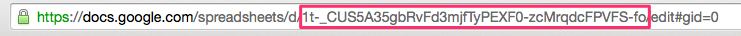

# Babel Bot

Babel Bot facilitates the collaboration between developers and content writers to provide application ready content across languages.  Developers and content providers share a Google spreadsheet where new keys can quickly be added and translations can be quickly modified.  A single executable can be run to pull down the content and convert it into the application required string file format.

Babel Bot relies heavily on the fantastic [twine](https://github.com/mobiata/twine) gem.  However, instead of sharing a Twine formatted file across applications, a Google spreadsheet is used for easier collaboration across departments and companies.

Babel Bot has only been tested on iOS and Android projects, but should work with the other formats supported by the twine gem.

## Installation

Add this line to your application's Gemfile:

```ruby
gem "babel_bot"
```

And then execute:

    $ bundle
    
## Google Drive API Configuration

In order to fetch the Google spreadsheet content, a project will need to be enabled for API access.
  
- Head to the [Google Developers Console](https://console.developers.google.com)
- Create a new project
- Navigate to the "Credentials" section and create credentials.
- Proceed through the consent screen and select "Web Application" as the application type
- When prompted, select "OAuth client ID" as the credential type
- When asked to provided "Redirect URIs", enter "http://localhost:9292/"
- Download the credentials file
- Place this file in your project home directory and name it `client_secrets.json`
- It is recommended to change the permissions on `client_secrets.json` to readonly for all users
- Navigate to "Google Drive API" and enable the API

## Create Your Project Config

Each project should have a configuration checked in to be shared among the developers.  [An example config can be found in the examples folder.](examples/config.json).  Below is a brief explanation of each configuration param

- `googleAppName` - The application name of the Google Project created above.
- `fileId` - The Google doc ID.  This can be found in the document URI between the `/d/` and `/edit` path components



- `apiCachePath` - Path to cache Google Drive discovery API. 
- `credentialsCachePath` - Path to cache OAuth2 tokens
- `twineFilePath` - Path to store intermediate Twine file
- `projectLocalesPath` - Project path to directory containing locale specific subdirectories.  For iOS, this is the directory containing the `LOCALE.lproj` directories.  For Android, this is the directory containing the `values-LOCALE` directories

Make sure all paths specified already exist.

## Generating Strings

With your configuration in place, run

    $ bundle exec babel-bot generate-strings PATH_TO_CONFIG

If you are using Bundler, you can run using `bundle exec` to eliminate the JSON version warnings caused by the Google API client.

## Google Spreadsheet Format

There are three column headers required:

- `Key` - This is the key referenced in code
- `Comment` - A comment providing some context to the key
- `en` - The development locale.  Currently, this is hardcoded to `en`, but could be configurable in later versions

Additional headers can be added and will be treated as new locales.  In [this sample](https://docs.google.com/spreadsheets/d/1t-_CUS5A35gbRvFd3mjfTyPEXF0-zcMrqdcFPVFS-fo/edit?usp=sharing), string files will be generated for English, French and German.

## Known Issues

### I am being asked to authenticate every time the executable runs

Google's OAuth API only returns a refresh token the first time you authenticate and create a connected app.  If you lose your cached oauth tokens, you will need to revoke and regrant application access.  Instructions to do so can be found [here](http://stackoverflow.com/questions/10827920/google-oauth-refresh-token-is-not-being-received)

## Development

After checking out the repo, run `bin/setup` to install dependencies. Then, run `rake test` to run the tests. You can also run `bin/console` for an interactive prompt that will allow you to experiment.

To install this gem onto your local machine, run `bundle exec rake install`. 

## Contributing

Bug reports and pull requests are welcome via GitHub. This project is intended to be a safe, welcoming space for collaboration, and contributors are expected to adhere to the [Contributor Covenant](contributor-covenant.org) code of conduct.


## License

The gem is available as open source under the terms of the [BSD-3-Clause](./LICENSE.txt).

